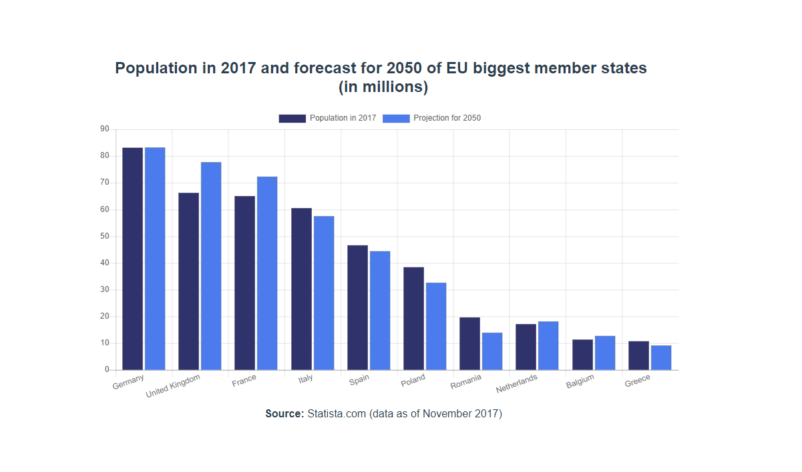

# vue-chartjs

> A Vue - Chart.js graph with current (2017) and projected (2050) population of largest EU countries

## Build Setup

```bash
# install dependencies
npm install

# serve with hot reload at localhost:8080
npm run dev
```

## Image


